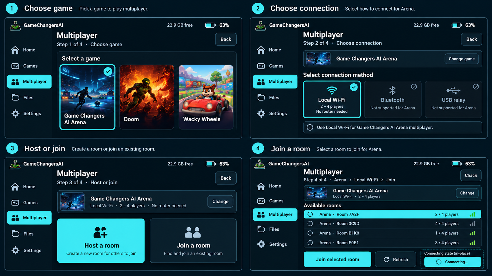

# Tab5 multiplayer hierarchy

`concept.png` is the ImageGen exploration requested for the multiplayer menu
repair. It proposes a game-first sequence, a supported-connection choice,
Host/Join, and persistent connection progress within the existing navy/cyan
Tab5 shell. It is a design reference, not a device screenshot.



The implementation uses the native Console Shell:

1. Choose a game from the bounded installed multiplayer registry and built-ins.
2. Choose a supported connection. Doom Arena by Game Changers requires Local Wi-Fi.
3. Host a room with that game's settings, or join a room for that game.
4. Stay on a connection/waiting panel until the host starts or an actionable
   error returns the guest to room selection.

The game selector displays twelve entries per page in a two-column grid,
with a title count, page number, and explicit More games / Previous games
controls when needed. Both development Tab5 logs report nine registered native
multiplayer titles, alongside the three built-in Doom-family entries. The
screens below mirror those names; disabled Chex Quest illustrates missing
optional content, not a claim about either card's current WADs. Entries come
from the validated installed registry, so removing a cartridge removes its row.

Back returns one level, including while a connection is starting. Host/Join
remain disabled until the chosen transport is ready. Host settings contain
only applicable game options.
The room selection binds the advertised session identity across asynchronous
scan updates. Guest and host controls remain distinct throughout startup.

The PNGs named `multiplayer-*.png` beside this file are software-rendered
screens from `console_shell_tab5_tests`, with fixture runtime data. They
verify layout and do not establish physical connectivity or gameplay.

- [Choose a game](multiplayer-games.png)
- [Choose a connection](multiplayer-connection.png)
- [Additional registry entries](multiplayer-more-games.png)
- [Large-text setting](multiplayer-large-text.png)
- [Wi-Fi starting](multiplayer-role-starting.png)
- [Wi-Fi startup error](multiplayer-role-error.png)
- [Ready to host or join](multiplayer-role-ready.png)
- [Connected room](multiplayer-connected.png)
- [Arena host settings](multiplayer-arena-settings.png)

See [the multiplayer contract](../../../docs/MULTIPLAYER.md) for the session
fixes, host regression commands, and outstanding two-console acceptance.

Reproduce the inventory and layout checks with:

```sh
PATH="$PWD/.tools/host-venv/bin:$PATH" make console-shell-host
python3 scripts/tests/test-console-multiplayer-inventory.py
build-host/console_shell/tests/console_shell_tab5_tests build-host/console_shell/multiplayer-inventory-review
```

The last command writes lossless PPM frames. These PNGs encode those same
pixels for review. The inventory test validates source manifest fixtures and
executes the production registry and runtime publisher, including removal,
invalid-package, and single-player exclusions.
