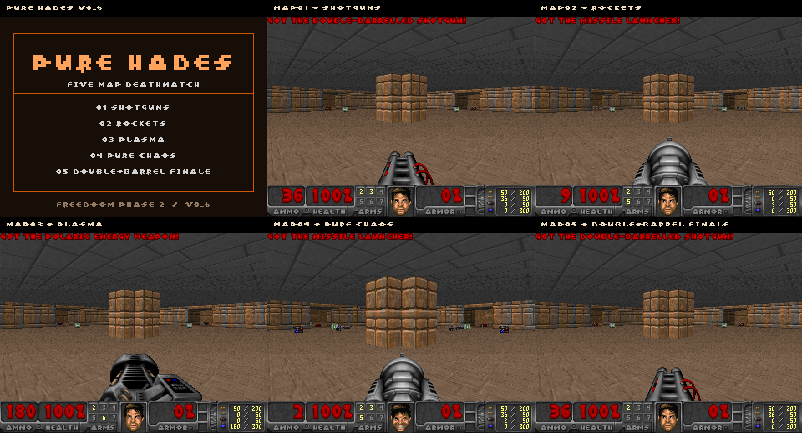

# Pure Hades v0.6

Five fast, symmetric deathmatch variants for **Freedoom Phase 2**. Pure Hades is a remix of a new reconstruction from Will's rough 2012 Pure Hell sketch and remembered layout. It is not a recovered historical WAD.



## Start here

Download [official Freedoom Phase 1 + 2](https://freedoom.github.io/download.html), unzip it, and use **freedoom2.wad**. Phase 2 provides the Doom II-compatible weapons, including the double-barrel super shotgun. No commercial Doom purchase is required when using Freedoom.

The exact game-data release tested is [Freedoom 0.13.0](https://github.com/freedoom/freedoom/releases/tag/v0.13.0). Download an engine separately; the tests used [Chocolate Doom 3.1.1](https://www.chocolate-doom.org/wiki/index.php/Downloads). This package contains no engine, installer, or IWAD.

Extract this package and load **PUREHADES.WAD** as an additional WAD alongside **freedoom2.wad**. Do not load an older Pure Hell WAD at the same time. The MIDI music is already inside PUREHADES.WAD; you do not need to load the loose MIDI files.

From a folder containing both WADs, with Chocolate Doom available on your command path:

```text
chocolate-doom -iwad freedoom2.wad -file PUREHADES.WAD -warp 1
```

Replace the final number with **1, 2, 3, 4, or 5** to choose a map. Windows uses `chocolate-doom.exe`. A launcher can select the same base IWAD, additional WAD, and map without typing a command.

## The five maps

| Map | Variant | Weapon pickups | Ammunition | Health |
| --- | --- | --- | --- | --- |
| MAP01 | Shotguns | 8 shotguns, 8 super shotguns; gated central BFG | 16 shell boxes | 16 medikits + 8 stimpacks |
| MAP02 | Rockets | 16 rocket launchers; gated central BFG | 16 rocket boxes | Same |
| MAP03 | Plasma | 16 plasma guns; gated central BFG | 16 cell packs | Same |
| MAP04 | Pure Chaos | 8 shotguns, 8 super shotguns, 4 chainguns, 4 rocket launchers, 4 plasma guns, 4 chainsaws; gated central BFG | 16 shell boxes, 4 bullet boxes, 8 rocket boxes, 8 cell packs | Same |
| MAP05 | Double-Barrel Finale | **16 super shotguns only**; no single-barrel shotguns or BFG | 16 shell boxes | Same |

Each cell pack supplies 100 cells; a cell pickup in the plasma gun supplies its normal engine amount. The weapon/ammo placements, health, routes and deathmatch starts are symmetric under quarter turns and reflections. The single player-one test start and single hidden exit are deliberate exceptions. Symmetry does not establish human competitive balance.

Fists and the pistol are standard Doom spawn inventory, not ordinary placeable weapon pickups. Pure Chaos includes all seven placeable Doom II weapon types, including the chainsaw and BFG. Deathmatch players begin with normal fresh inventory. Normal single-player/co-op inventory carryover still follows the selected engine's rules.

MAP01 and MAP02 preserve the earlier v0.5 map lumps exactly. All five maps use the established arena, four satellite rooms, connectors and red outer loop. MAP05 keeps the solid central obstacle but removes the BFG, its reward/secret tag, all five moving-floor tags, the four switch actions and their switch artwork. There is no obsolete BFG puzzle in the finale. The hidden health doors remain functional.

## Deathmatch setup

Use the engine's normal multiplayer setup or these command-line equivalents. All players need the same Freedoom IWAD, this exact WAD version, and compatible engine versions.

Host a private server:

```text
chocolate-doom -iwad freedoom2.wad -file PUREHADES.WAD -server -privateserver -altdeath -warp 1
```

Join the host, replacing `HOST` with its LAN name or address:

```text
chocolate-doom -iwad freedoom2.wad -file PUREHADES.WAD -connect HOST
```

`-altdeath` selects alternate deathmatch, which replenishes items. Chocolate Doom supports up to four players; eight positions provide possible deathmatch starts. The engine's multiplayer setup can supply the same options.

### Map progression and rotation

The hidden exit advances **MAP01 → MAP02 → MAP03 → MAP04 → MAP05**. Its location is the north satellite room's outer wall, 96 map units west/left of the former switch position: approach approximately `(-96, 1056)`, face north, and press Use.

The WAD includes UMAPINFO declaring **MAP05 → MAP01** for engines that support it. That metadata is included, but a UMAPINFO engine was not installed in the test environment, so the loop itself is **not runtime-verified**.

**Chocolate Doom ignores UMAPINFO. Its MAP05 exit continues into Freedoom's MAP06.** For a five-map-only Chocolate Doom session, finish at MAP05 and have the host start the next match again with `-warp 1`. The host can choose any included map with `-warp 1` through `-warp 5`. This manual selection is the tested compatibility fallback; do not assume an automatic five-map loop in Chocolate Doom.

## BFG and health secrets

On MAP01–MAP04, use the outside-wall switch in **each** of the four satellite rooms. After all four are activated, use the central pillar to lower the BFG vault. Pressing one switch repeatedly does not substitute for the others. Pure Chaos retains this gate.

Hidden medikit doors sit in the red outer walls of the perimeter halls. Face the wall and press Use; the doors can be reopened from inside. MAP05 has these health secrets but no BFG secret or visible BFG switches.

## Music

Five distinct original community compositions from the **Ultimate MIDI Pack, OpenGameArt edition**, licensed **CC BY-SA 4.0**:

| Map | Track | Composer |
| --- | --- | --- |
| MAP01 | Escaping the Darkness | Myrgharok |
| MAP02 | Siege Mentality | NeilJohnRips |
| MAP03 | A Compact Hell | Sego |
| MAP04 | Ant Farm Melee | Lee Jackson, ASCAP |
| MAP05 | Dethrone the Tyrant | Manniacc |

The finale is an original thrash-metal composition; the composer's included notes describe Metallica as an influence. No Metallica recording or cover arrangement is included.

The MIDI bytes are unchanged. We assigned them to the five level music lumps; MAP01's track also plays on the title screen and MAP04's track at intermission. Sound depends on your MIDI synthesizer. See [CREDITS.md](CREDITS.md), the original pack readme and [music/tracklist.json](music/tracklist.json) for complete attribution, source filenames and hashes.

## Rebuild and verify

Python 3, standard library only:

```text
python3 source/build.py
python3 source/validate.py
```

The build uses only the included source, licensed MIDIs and small title graphics. It does not download or install anything. `source/base_map.py` generates the common geometry; `source/build.py` produces all variants and the WAD. `manifest.json` describes requirements, map counts, music, hashes and launch examples.

Optional engine checks require a separately installed Chocolate Doom executable and Freedoom Phase 2. Set `PURE_HADES_IWAD` to your `freedoom2.wad` path and `PURE_HADES_ENGINE` to the engine executable, then run `python3 source/check_gameplay.py`. This runs bounded local, headless demo tests and writes test artifacts under `build/`; it does not change settings or install software.

## Validation and limits

Read `validation/` for structural, symmetry and engine results. Tests cover serialized WAD/BSP bounds, eight deathmatch starts per map, weapon/ammo/health counts, pickup symmetry, route distances, hidden exits, native pickup/firing, four player slots in both deathmatch modes, the chaos BFG gate and the removed finale controls. Music is tested with capture/logging hooks that leave gameplay and music logic unchanged.

Four-player tests are local recorded netdemos in the actual engine, not a new live session across four computers. Human playtesting is still needed for balance and preferred ammo quantities. Existing Pure Hell releases and previously published videos remain separate from this new release.

## Sharing and licenses

This edition is intended for redistribution with the included credits and licenses. Maps/content: **CC BY-SA 4.0**. Original Python source: **MIT**. Music: **CC BY-SA 4.0**. Freedoom-derived font/title artwork: **BSD 3-Clause**. See [LICENSE](LICENSE) and [CREDITS.md](CREDITS.md). The components retain their own notices; inclusion does not imply endorsement by any contributor.
